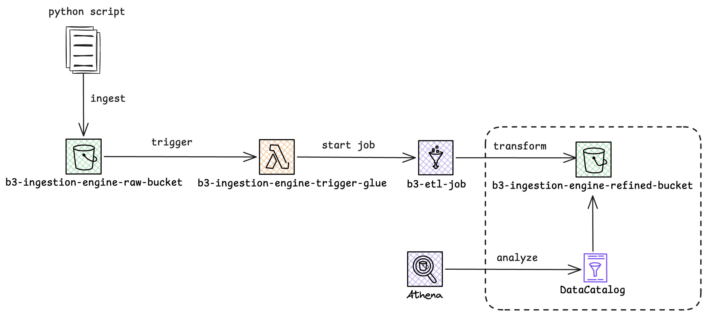

# Bovespa Batch Data Pipeline 📈

This project is a complete automated data pipeline developed for the **FIAP Machine Learning Engineering** Tech Challenge. It automates the extraction, ingestion, and transformation of B3 (Bovespa) stock market data using a serverless architecture on AWS.

## 🏗️ Architecture Overview

The pipeline follows a modern Data Lake architecture (Raw/Refined layers):

1. **Ingestion**: A Python script uses `yfinance` to fetch daily B3 data and uploads it as `.parquet` to **AWS S3 (Raw Zone)**.
2. **Trigger**: An S3 Event Notification triggers an **AWS Lambda** function upon every new file upload.
3. **ETL Process**: The Lambda function starts an **AWS Glue Job** (PySpark) that performs:
    - Data cleaning and column renaming.
    - Numeric aggregation (Volume/Price grouping).
    - Time-series calculations (Moving Averages/Price deltas).
4. **Refinement**: Processed data is saved back to **AWS S3 (Refined Zone)** in partitioned Parquet format.
5. **Consumption**: Data is cataloged in the **AWS Glue Data Catalog** and made available for SQL queries via **Amazon Athena**.

## 🛠️ Tech Stack

- **Language:** Python 3.x / PySpark
- **Infrastructure:** AWS (S3, Lambda, Glue, Athena, IAM)
- **Libraries:** `yfinance`, `pandas`, `boto3`, `pyarrow`

## 🚀 How to Run

1. **Local Ingestion**: Run `python src/ingestion/main.py` to fetch data and upload to the S3 Raw bucket.
2. **Automated Trigger**: The Lambda function will automatically detect the file and start the Glue ETL Job.
3. **Querying**: Once the Glue Job status is "Succeeded", go to **Amazon Athena** to query the results.